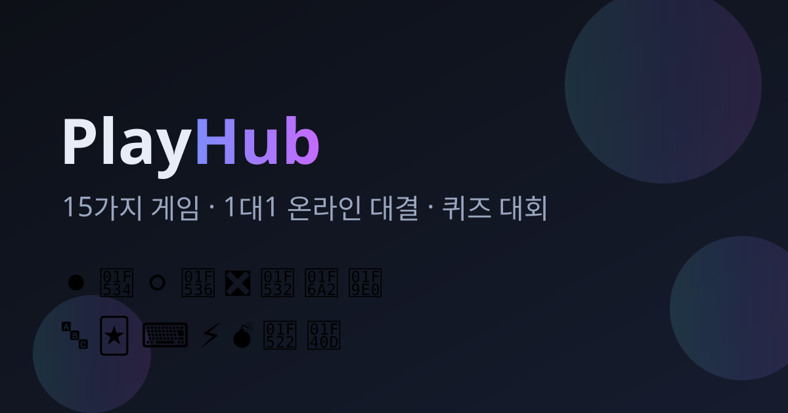

# 🎲 PlayHub

**15가지 게임이 담긴 온라인 게임 허브.** 오목부터 퀴즈 배틀까지 전부 1대1로,
컴퓨터와 혼자서도, 한 기기에서 둘이서도, 인터넷 너머의 사람과도.

로비에서 만나고, 방을 만들고, 퀴즈 대회를 엽니다.

<p align="center">
  
</p>

---

## 지금 해보기

**서버 없이도 전부 즐길 수 있습니다.** GitHub Pages에 올라간 페이지를 열면
15가지 게임 전부를 컴퓨터와, 또는 한 기기에서 둘이 바로 할 수 있습니다.
다른 사람과 온라인으로 붙으려면 서버 하나만 띄우면 됩니다 →
[배포 가이드](docs/DEPLOY.md)

로컬에서 전부(웹 + 온라인) 한 번에 실행하려면:

```bash
git clone https://github.com/elel99gg34-code/playhub.git
cd playhub
npm install
npm start
# http://localhost:8080 접속 — 웹과 서버가 같은 주소에서 함께 뜹니다
```

---

## 수록된 게임 15종

| | 게임 | 종류 | 방식 | AI |
|---|---|---|---|:--:|
| 🧠 | **퀴즈 배틀** — 같은 문제를 동시에, 정확하고 빠르게 | 지식 | 동시 | ✅ |
| ⚫ | **오목** — 15×15, 다섯 개를 먼저 | 보드 | 턴제 | ✅ |
| 🔴 | **커넥트4** — 동전을 떨어뜨려 넷을 연결 | 보드 | 턴제 | ✅ |
| ⚪ | **리버시** — 양쪽에서 감싸 뒤집기 | 보드 | 턴제 | ✅ |
| ❎ | **얼티밋 틱택토** — 작은 판 9개가 모인 큰 판 | 전략 | 턴제 | ✅ |
| 🔶 | **체커** — 잡을 수 있으면 반드시 잡는다 | 보드 | 턴제 | ✅ |
| 🔲 | **점과 상자** — 상자를 완성하면 한 번 더 | 전략 | 턴제 | ✅ |
| 🚢 | **해전게임** — 보이지 않는 함대를 좌표로 추격 | 전략 | 턴제 | ✅ |
| 🔤 | **끝말잇기** — 두음법칙까지 인정하는 낱말 잇기 | 지식 | 턴제 | ✅ |
| 🃏 | **기억력 카드** — 맞히면 한 번 더 | 두뇌 | 턴제 | ✅ |
| ⌨️ | **타이핑 레이스** — 같은 지문, 더 빠르고 정확하게 | 순발력 | 동시 | ✅ |
| ⚡ | **반응속도 결투** — 초록으로 바뀌는 순간 | 순발력 | 동시 | ✅ |
| 💣 | **지뢰찾기 듀얼** — 똑같은 지뢰밭을 둘이 동시에 | 퍼즐 | 스피드 | – |
| 🔢 | **2048 듀얼** — 같은 타일 운, 더 높은 점수 | 퍼즐 | 스피드 | – |
| 🐍 | **스네이크 듀얼** — 먹을수록 길어지고 위험해진다 | 순발력 | 스피드 | – |

---

## 온라인으로 함께 놀기

- **로비** — 접속한 사람, 열린 방, 전체 채팅이 한 화면에. 여기가 "만나는 공간"입니다.
- **빠른 대전** — 게임만 고르면 같은 게임을 기다리는 사람과 자동으로 짝지어 줍니다.
- **방 만들기** — 공개 방은 로비 목록에, 비공개 방은 4글자 코드로만. 친구와 놀 때 편합니다.
- **관전** — 자리가 찬 방은 관전으로 들어갑니다. 숨겨진 정보가 있는 게임은 관전자에게도 가려집니다.
- **재접속** — 경기 중 연결이 끊겨도 자리가 **90초** 유지됩니다. 그 안에 돌아오면 하던 판을 이어서 합니다.

### 🔐 계정

로그인은 **선택**입니다. 손님으로도 모든 게임과 온라인 대전이 됩니다. 가입하면:

- **이름이 예약됩니다** — 내 아이디는 다른 사람이 손님으로도 쓸 수 없습니다.
- **전적이 남습니다** — 승·패·무가 게임별로 계속 쌓입니다.
- **순위표에 오릅니다** — 로비에서 순위를 보고, 남의 이름을 눌러 전적을 볼 수 있습니다.

비밀번호는 계정마다 다른 솔트와 함께 scrypt로 해시해 보관하며 원문은 어디에도 남기지
않습니다. 로그인 상태는 HMAC 서명 토큰으로 유지되어 서버를 재시작해도 풀리지 않고,
비밀번호를 바꾸면 다른 기기의 세션은 전부 무효화됩니다. 반복된 로그인 실패에는 점점
길어지는 대기 시간이 붙고, 없는 아이디와 틀린 비밀번호는 **같은 문구로** 거절되어
아이디가 존재하는지 떠보는 것도 막습니다.

계정을 아예 쓰고 싶지 않다면 서버에 `ACCOUNTS=0` 을 주면 손님 전용으로 돕니다.

### 🏆 대회 (토너먼트)

어떤 게임으로든 **4·8·16명 단판 토너먼트**를 열 수 있습니다. 퀴즈 배틀이 기본 종목입니다.

시작을 누르면 서버가 대진을 짜고, 경기마다 방을 열어 참가자를 자동 배정하고,
승자를 다음 라운드로 올립니다. 인원이 정원보다 적으면 **부전승**으로 채우고,
중간에 나간 사람은 **기권 처리**되어 대회가 멈추지 않습니다.

---

## 어떻게 만들어졌나

한 벌의 규칙, 두 개의 런타임.

```
shared/games/*.js     15개 규칙 엔진 — DOM도 네트워크도 모르는 순수 모듈
      ├── 브라우저가 import → 화면을 그리고, 오프라인·AI 대전을 굴린다
      └── 서버가 import    → 온라인 경기를 심판한다
```

클라이언트가 그린 수는 **서버가 이미 동의한 수**입니다. 규칙책이 두 벌이 아니니
어긋날 일도 없습니다. 엔진은 `createState / status / applyMove`와 선택적인
`view / tick / legalMoves / ai`를 내보내는 하나의 계약을 지킵니다
(→ [`shared/games/_engine.js`](shared/games/_engine.js)).

```
index.html              사이트 진입점 (빌드 단계 없음)
app/                    웹 클라이언트 — 프레임워크 없는 ES 모듈
  ├── css/style.css     디자인 시스템 (다크·라이트 토큰)
  ├── js/games/*.js     게임별 화면 15개
  ├── js/views/*.js     허브·로비·방·대회·도움말
  ├── js/local.js       오프라인(AI·한 기기 둘이) 진행기
  └── js/net.js         WebSocket 클라이언트 (재연결·시계 동기)
shared/                 두 런타임이 함께 쓰는 코드
  ├── games/*.js        규칙 엔진 15개
  ├── data/             퀴즈 문제 은행, 끝말잇기 사전, 타이핑 지문
  ├── hangul.js         한글 음절 분해 · 두음법칙
  └── protocol.js       메시지 타입과 입력 정제
server/src/             접속·로비·방·매칭·대회 + 10Hz 타이머
tests/                  의존성 없는 테스트 러너 + 107개 테스트 + 브라우저 E2E
```

**빌드 도구도, 번들러도, 프레임워크도 없습니다.** `shared/`를 브라우저와 Node가
그대로 import하기 때문에 정적 호스팅에 그냥 올라가고, 서버는 파일 하나로 실행됩니다.
런타임 의존성은 `ws` 하나뿐입니다.

### 공정성

규칙 판정은 전부 서버에서 이루어집니다. 특히 신경 쓴 부분:

- **숨겨진 정보는 전송 자체를 하지 않습니다.** 상대 함대, 지뢰 위치, 퀴즈 정답,
  뒤집히지 않은 카드는 서버에만 있습니다. 관전자용 시야(`spectatorView`)도 따로 있어
  관전이 훈수 통로가 되지 않습니다.
- **시간은 서버 시계로 잽니다.** 퀴즈 응답 속도, 턴 제한 시간 모두.
- **클라이언트가 보고하는 값은 보정됩니다.** 타이핑 진도는 사람이 칠 수 있는
  최대 속도로 잘리고, 반응속도는 서버가 관측한 범위 안으로 맞춰집니다.
- **재시뮬레이션.** 2048·지뢰찾기·스네이크는 같은 시드로 만든 판에 모든 입력을
  서버가 다시 돌려 점수를 확인합니다.

반응속도 결투는 두 화면이 **서버 시각 기준으로 동시에** 초록이 됩니다. 지연 시간은
"언제 보이는가"를 양쪽 똑같이 밀 뿐, 점수에 더해지지 않습니다.

---

## 개발

```bash
npm install
npm start              # 웹 + 서버 (http://localhost:8080)
npm run dev            # 파일 변경 시 자동 재시작
npm test               # 107개 테스트 (엔진 규칙 + 서버 통합)
npm run test:browser   # 실제 크로미움 2개로 온라인 대국까지 검증
```

`npm test`는 의존성이 없습니다. 엔진 계약 준수, 보드 게임마다 수천 번의 무작위
대국, 그리고 틀리기 쉬운 규칙들(강제 점프, 두음법칙, 한 수에 한 번만 합치기,
부정 출발, `view()`를 통한 정보 유출)을 확인합니다.

### 게임 추가하기

1. `shared/games/내게임.js` — 엔진 계약대로 규칙을 씁니다.
2. `app/js/games/내게임.js` — `createView({ mount, onMove, sound })`로 화면을 그립니다.
3. 두 `index.js`의 목록에 한 줄씩 추가합니다.

로비·방·매칭·대회·관전·재접속은 전부 그대로 동작합니다.

### 환경 변수

| 변수 | 기본값 | 설명 |
|---|---|---|
| `PORT` | `8080` | 수신 포트 |
| `HOST` | `0.0.0.0` | 바인드 주소 |
| `SERVE_STATIC` | 켜짐 | `0`이면 정적 파일 서빙을 끕니다 |
| `ALLOWED_ORIGINS` | 전체 허용 | 쉼표로 구분한 WebSocket origin 허용 목록 |
| `LOG_LEVEL` | `info` | `debug` \| `info` \| `warn` \| `error` |
| `ACCOUNTS` | 켜짐 | `0`이면 손님 전용으로 실행합니다 |
| `DATA_DIR` | `./data` | `accounts.json`이 저장되는 위치 |
| `AUTH_SECRET` | 자동 생성 | 세션 토큰 서명 키. 디스크가 초기화되는 호스팅에서는 직접 지정하세요 |

---

## 배포

- **웹만 (무료, 설정 없음)** — 기본 브랜치에 푸시하면 GitHub Actions가 GitHub Pages로
  올립니다. 저장소 Settings → Pages → Source를 **GitHub Actions**로 한 번만 바꾸면 됩니다.
  병합 전에 미리 보고 싶다면 Actions 탭에서 워크플로를 수동 실행하면 됩니다.
- **온라인 대전까지** — Render / Fly.io / Railway / Docker 중 아무거나. 설정 파일이
  전부 들어 있습니다. 자세한 절차는 **[docs/DEPLOY.md](docs/DEPLOY.md)**.

  [](https://render.com/deploy?repo=https://github.com/elel99gg34-code/playhub)

  이 버튼을 누르면 Render가 저장소의 `render.yaml`을 읽어 서버를 띄웁니다. 무료 플랜은
  디스크가 재배포마다 초기화되므로, **계정을 계속 유지하려면 Persistent Disk를 붙이고
  `DATA_DIR`을 그 경로로 지정**하세요 (자세한 내용은 배포 가이드).

배포한 서버 주소를 모두가 자동으로 쓰게 하려면
[`app/js/config.js`](app/js/config.js)의 `DEFAULT_SERVER`에 적어 두세요.
그러면 방문자는 아무 설정 없이 바로 온라인으로 연결됩니다.

---

## 라이선스

MIT — [LICENSE](LICENSE)
